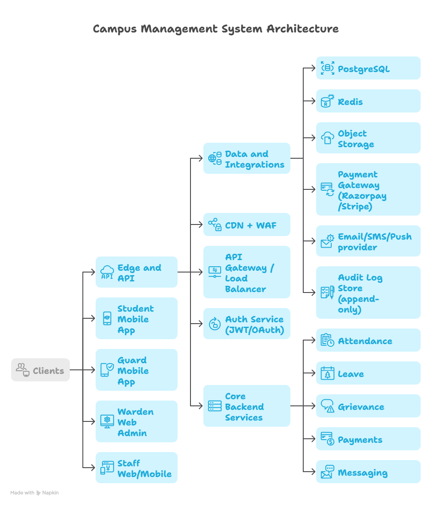

# HostelPulse

<aside>
🏨

**Product name (app): HostelPulse**

A Smart Hostel Management & QR Attendance System for safer campuses, faster operations, and verifiable student movement.

</aside>

### Table of contents

---

### 1. Executive Summary

Hostel operations in many institutions still rely on manual registers, paper forms, and fragmented communication between students, wardens, guards, and maintenance staff. These processes are slow, error-prone, and difficult to audit. They also create real safety risks when attendance is unreliable, leave approvals are unclear, grievances are not tracked, and payment records are inconsistent.

**HostelPulse** is a centralized, role-based web and mobile platform that digitizes hostel operations end-to-end with verifiable workflows and strong security controls. The system addresses:

- **Manual attendance issues:** replaces registers with **dynamic, time-bound QR attendance** and server-side verification.
- **Paper-based leave management:** replaces handwritten leave slips with a controlled approval workflow that is visible to the guard and recorded in an audit log.
- **Delayed grievance handling:** introduces a structured ticketing system with prioritization, staff assignment, proof-of-completion uploads, and student notifications.
- **Payment tracking problems:** provides integrated online payments with automated receipts, email confirmations, and reconciliation support.
- **Communication gaps:** enables real-time, ticket-based frontdesk messaging for traceable conversations between students and wardens.

The platform introduces **automation** (less manual work), **transparency** (status and history visible to the right roles), **accountability** (audit logs, assignment trails, completion evidence), and **security** (RBAC, JWT authentication, encrypted data, secure QR tokens, and anti-cheating checks).

From an investor and deployment standpoint, HostelPulse is designed as a scalable SaaS offering with institution-specific configurations, cloud-native hosting, and modular components (attendance, leave, grievances, payments, messaging). The result is a system that can be rolled out incrementally while delivering measurable operational efficiency and improved student safety.

---

### 2. Problem Statement

Traditional hostel management faces persistent operational and compliance challenges:

1. **Attendance fraud and low trust**
    - Proxy marking and manipulated paper registers.
    - Lack of real-time visibility for wardens and guards.
    - No robust audit trail.
2. **Leave mismanagement**
    - Paper forms get delayed, lost, or altered.
    - Guards may not receive accurate, up-to-date approvals.
    - Return and re-entry are often not recorded consistently.
3. **Payment verification delays and disputes**
    - Students pay through inconsistent channels (cash, UPI screenshots, bank transfers).
    - Wardens reconcile manually, creating delays in verification.
    - Receipts and ledger history may be incomplete.
4. **Poor grievance tracking**
    - Complaints are verbal or written in registers.
    - No prioritization, assignment, or SLA tracking.
    - Students do not receive reliable updates.
5. **Lack of real-time communication**
    - Students depend on phone calls, WhatsApp groups, or in-person visits.
    - Communication lacks traceability and structured follow-up.
6. **No centralized student record management**
    - Records are spread across spreadsheets, physical files, and departments.
    - Identity and document verification is inconsistent.
    - Access to sensitive information is often not well controlled.

These problems lead to increased administrative workload, lower student satisfaction, delayed resolution of safety-critical issues, and higher institutional risk.

---

### 3. Proposed Solution Overview

HostelPulse is a **centralized multi-role platform** available as:

- **Web application** for administrative work (warden/admin, staff dashboards).
- **Mobile application** for students and guards (attendance scanning, notifications, messaging).

The system uses **role-based authentication (RBAC)** to ensure each user only sees and performs actions permitted by policy.

#### Core roles and interactions

- **Student**
    - Views profile, room, and roommate details.
    - Pays hostel fees online and views receipts.
    - Requests leave and receives approvals/rejections.
    - Raises grievances, uploads images, and tracks resolution.
    - Chats with the frontdesk (warden) in ticketed threads.
    - Scans QR for attendance and receives confirmation.
- **Warden (Admin)**
    - Creates and manages student records and room allocations.
    - Uploads/verifies official documents (as per institutional policy).
    - Approves/rejects leave, oversees guard visibility.
    - Monitors grievances, assigns tasks to staff, and validates closure.
    - Verifies payments, generates receipts, sends notifications.
    - Broadcasts events and operational alerts.
- **Staff**
    - Receives assigned grievance/work tasks.
    - Updates status (in progress, completed), uploads completion proof.
    - Communicates updates to the warden and student via the system.
- **Guard**
    - Views approved leave requests (to validate exits/entries).
    - Conducts QR attendance for blocks and batches.
    - Generates late-entry QR when authorized.
    - Monitors absent/missing students list.
    - Uses a live attendance dashboard for operational visibility.

---

### 4. Detailed Feature Breakdown

## 4.1 Student Module

### A. Dashboard

After login, a student can view:

- **Room details:** Block, Floor, Room Number
- **Roommate details:** names and basic identifiers (as per privacy policy)
- **Personal profile:** data and documents uploaded by warden/admin (read-only)

**Key design principle:** student view is informative, not administrative. Students can request corrections via frontdesk messaging if needed.

### B. Hostel Payment

Capabilities:

- View **current dues** and payment schedule
- Pay online via integrated **payment gateway**
- Receive **auto-generated digital receipt** with transaction reference
- Receive **email receipt confirmation**
- View **payment history** (date, amount, method, status)

**Workflow (Payment):**

1. Student opens Payment screen.
2. System fetches outstanding dues from billing ledger.
3. Student initiates payment.
4. Payment gateway returns payment status via secure callback/webhook.
5. System posts a ledger entry and generates a receipt.
6. Email notification sent to student.
7. Warden dashboard shows updated payment state.

**Failure handling:**

- If gateway status is pending/failed, the ledger remains unchanged until confirmed.
- Duplicate webhook handling is idempotent by payment reference.

### C. Leave Request Module

**Leave Request Form fields:**

- Name
- Address
- Hostel Name
- Room Number
- Year and Semester
- Registration Number
- Phone Number (Self)
- Type of Leave (e.g., weekend, medical, emergency, academic)
- Extra Details
- Place of Visit
- Parent Phone Number
- Leave From Date – To Date
- Upload confirmation document (mentor approval)

**Workflow (Leave Request):**

1. **Submit:** Student submits leave request with dates and supporting document.
2. **Warden review:** Warden approves or rejects.
3. **Guard visibility:** Approved leave appears in guard dashboard for exit/entry validation.
4. **Status notification:** Student receives notification (approved/rejected) and can view details.

**Exit/Entry attendance (Leave):**

- When leaving, the guard validates the student against an approved leave record, then records exit (QR or guard confirmation).
- When returning, guard records re-entry.
- Both events are stored with timestamp, location checks (if enabled), and guard device identity.

### D. Grievance Portal (Room Setting)

A structured grievance/ticketing system with categorization and prioritization.

**Fields:**

- Related To: Housekeeping (or other operational domain)
- Priority: High / Medium / Low
- Category (with suggested subcategories):
    - **Electrical:** power outage, socket fault, fan not working, light fixture, MCB trip, inverter backup
    - **Cleaning:** room cleaning, washroom cleaning, corridor cleaning, garbage pickup, pest control
    - **Plumbing:** leakage, clogged drain, low water pressure, flush issue, geyser/water heater
    - **Carpentry:** door latch, cupboard hinge, bed repair, window lock, table/chair repair
    - **Connectivity:** Wi‑Fi down, weak signal, LAN port, authentication/login issue, router issue
    - **Electronics:** refrigerator, water cooler, washing machine, CCTV display, access devices
    - **Food:** quality complaint, hygiene issue, timing issue, menu issue, shortage
    - **Safety:** broken lock, suspicious activity, corridor lighting, harassment report, hazard
    - **Emergency:** medical emergency, fire hazard, gas leak, water flooding, electrical short
- Description
- Image Upload
- Submit

**Workflow (Grievance):**

1. Student creates a ticket with category, priority, and evidence.
2. Warden/admin triages (optional rules-based assignment).
3. Ticket is **assigned to staff** with SLA targets.
4. Staff updates progress and uploads completion proof.
5. Student receives notifications on updates and closure.
6. Warden can reopen or reassign if closure criteria are not met.

### E. Frontdesk Messaging

A real-time messaging interface designed for operational traceability.

- 1:1 chat between Student and Warden (frontdesk).
- **Ticket-based conversation logging:** each thread belongs to a case type (general query, leave clarification, payment issue, room change).
- Status tracking: Open → Awaiting Student → Awaiting Warden → Closed.

**Design goal:** reduce “lost context” and ensure continuity when warden shifts or staff changes.

### F. Room Change Request

A structured request flow connected to frontdesk.

**Fields:**

- Title
- Related to Frontdesk
- Priority
- Description
- Submit

**Workflow:**

1. Student submits request with reason and urgency.
2. Warden reviews availability/policy.
3. Warden approves and reallocates room OR rejects with reason.
4. Student gets status notification and updated room allocation (if approved).

### G. QR-Based Smart Attendance

Night attendance is managed by the guard with time windows and anti-cheating measures.

**Night Attendance Process:**

1. Guard selects **Block + Year (Semester)**.
2. System generates a **dynamic QR** valid only for a **defined time window**:
    - 1st Year: 7:30 PM – 9:00 PM
    - 2nd Year: 7:30 PM – 10:00 PM
3. Student scans QR using HostelPulse mobile app.
4. Server verifies the request and marks attendance.
5. Confirmation is sent to both student and guard.
6. Guard can view a **missing students list**.
7. **Late-entry QR generation** is supported when policy permits.

#### Anti-cheating mechanism (multi-signal verification)

HostelPulse combines several checks. The institution can enable/disable checks based on policy and privacy requirements.

- **Time-bound QR token expiration**
    - QR encodes a short-lived, signed token (e.g., 30–60 seconds), not static data.
    - Prevents screenshot reuse.
- **Encrypted session tokens**
    - App uses JWT access tokens for sessions.
    - Attendance submissions include a one-time nonce to prevent replay.
- **Location verification (student device GPS validation)**
    - Student app submits GPS coordinates.
    - Backend checks if coordinates fall within hostel geofence.
- **Guard device IP/MAC tracking**
    - Guard device identity is registered.
    - Attendance session is tied to the guard’s device and expected network.
    - Helps detect unauthorized QR sessions.
- **2-meter proximity validation rule**
    - Proximity can be enforced using Bluetooth Low Energy (BLE) or ultra-short location tolerance.
    - Backend validates that the student scan was near the guard device location (or within the same micro-geofence).

**Same mechanism applies during Leave Exit/Entry attendance** to ensure movement records are verifiable.

---

## 4.2 Warden (Admin) Module

Capabilities include:

- Student data entry and record management
- Identity/document capture (as required by the institution):
    - Aadhaar
    - PAN
    - Driving License
    - Bank Details
    - Official documents upload
- Approve / Reject Leave Requests
- Monitor grievances and enforce SLAs
- Assign staff tasks and manage workload
- Room allocation and room change approvals
- Verify payments and generate receipts
- Email notifications and broadcast event alerts

**Operational controls:**

- Policy configurations (attendance windows, leave rules, late-entry constraints).
- Role assignments and access reviews.

---

## 4.3 Staff Module

- View assigned work and ticket queue
- Update status: Assigned → In Progress → Completed
- Upload completion proof (image/document)
- Real-time updates to warden dashboard

---

## 4.4 Guard Module

- View approved leave requests (for exit/entry validation)
- Conduct QR attendance sessions
- Generate late entry QR (policy controlled)
- Monitor absent students
- Validate leave exits
- Live attendance dashboard (counts, missing list, exceptions)

---

### 5. System Architecture

HostelPulse follows a modern, API-first architecture designed for security, scalability, and maintainability.

#### 5.1 High-level component diagram (text description)

**Diagram (described):**

- Left: Clients
    - Student Mobile App
    - Guard Mobile App
    - Warden Web Admin
    - Staff Web/Mobile
- Middle: Edge and API
    - CDN + WAF
    - API Gateway / Load Balancer
    - Auth Service (JWT/OAuth)
    - Core Backend Services (Attendance, Leave, Grievance, Payments, Messaging)
- Right: Data and integrations
    - PostgreSQL (primary relational DB)
    - Redis (cache, rate limiting, session support)
    - Object Storage (documents/images)
    - Payment Gateway (Razorpay/Stripe)
    - Email/SMS/Push provider
    - Audit Log Store (append-only)

#### 5.2 Frontend (Web + Mobile)

- **Web:** Administrative workflows (warden, staff). Fast data tables, approvals, dashboards.
- **Mobile:** QR scanning, GPS checks, notifications, messaging.

#### 5.3 Backend (API-based architecture)

A backend exposes REST (or GraphQL) APIs for all modules:

- Identity and access
- Student profile and room allocation
- Attendance sessions and scans
- Leave requests, approvals, exit/entry
- Grievance tickets and assignments
- Payments and receipts
- Messaging and ticketing
- Notifications

**Design:**

- Modular services (logical or microservice-ready), deployed as containers.
- Background workers for email sending, payment reconciliation, and report generation.

#### 5.4 Database (Relational)

A relational database (PostgreSQL) supports integrity and auditing.

Key entity groups:

- Users, roles, permissions
- Student profiles, rooms, blocks
- Attendance sessions, attendance marks
- Leave requests, approvals, exit/entry events
- Grievance tickets, staff assignments, SLA metrics
- Payment ledger, invoices/receipts
- Messages, threads, attachments
- Audit logs

#### 5.5 Cloud hosting

Cloud-native deployment supports:

- Auto-scaling for peak attendance windows
- Multi-tenant institutions with isolated data policies
- Disaster recovery and backups

#### 5.6 Payment gateway integration

- Payment initiation from student app/web.
- Webhook verification for payment finality.
- Receipt generation and ledger update.

#### 5.7 File storage system

- Documents and images stored in object storage (e.g., S3/GCS).
- Access via time-limited signed URLs.
- Virus scanning pipeline recommended for uploads.

#### 5.8 Notification service (Email + Push)

- Email: receipts, approvals, critical alerts.
- Push: attendance confirmations, grievance updates, message alerts.

#### 5.9 Security controls built into architecture

- **RBAC:** role-based access control with least-privilege.
- **JWT Authentication:** short-lived access tokens + refresh tokens.
- **Secure API layers:** input validation, rate limiting, WAF.
- **Encrypted data storage:** encryption at rest; secrets managed in KMS.
- **Audit logs:** append-only tracking for approvals, updates, and sensitive reads.

---

### 6. Technology Stack (Modern Recommendation)

A practical and modern stack aligned with speed, cost, and hiring availability.

#### Frontend

- Web: **React + Next.js**
- Mobile: **React Native** (or Flutter if a single codebase and strong UI consistency is preferred)

#### Backend

- **FastAPI (Python)** for high-performance APIs and rapid iteration
    - Alternative: Django (faster admin scaffolding) or Node.js (JS/TS uniformity)

#### Database and infrastructure

- Database: **PostgreSQL**
- Cache/queues: **Redis**
- Async tasks: **Celery/RQ** (Python) or managed queues

#### Authentication

- **JWT** for API sessions
- **OAuth 2.0** for institutional SSO integrations (future-ready)

#### Cloud

- **AWS** (common choice)
    - ECS/EKS for containers
    - RDS for Postgres
    - S3 for storage
    - CloudFront + WAF
- Equivalent architectures are feasible on GCP/Azure.

#### Payments

- India-first: **Razorpay**
- Global: **Stripe**

#### Observability

- Logging: CloudWatch / ELK
- Tracing: OpenTelemetry
- Metrics: Prometheus/Grafana

---

### 7. Security Framework

Security is core to HostelPulse because it handles identity documents, location signals, and student safety workflows.

#### 7.1 End-to-end protection approach

- **In transit:** TLS 1.2+ for all traffic.
- **At rest:** database and object storage encryption.
- **Secrets:** stored in KMS/Secrets Manager.

#### 7.2 Secure QR token system

- QR contains a **signed token** (e.g., HMAC or asymmetric signature).
- Token includes:
    - attendanceSessionId
    - guardId (or deviceId)
    - time window and expiry
    - nonce / jti (unique token id)
- Server verifies signature and expiry before accepting scan.

#### 7.3 Location validation

- Geofencing based on hostel boundary.
- Configurable tolerance to handle GPS noise.
- Optional secondary checks: Wi‑Fi SSID allowlist, BLE proximity.

#### 7.4 Fraud prevention

- Replay attack prevention with nonces.
- Rate limiting per user/device.
- Device registration for guard devices.
- Anomaly detection rules:
    - frequent failed scans
    - scans far outside hostel boundary
    - repeated scans from same device for multiple accounts

#### 7.5 Secure document storage

- Object storage with private buckets.
- Access via signed URLs with expiration.
- Optional document watermarking (institution name, access time) for downloads.

#### 7.6 Role-based permissions

- Granular permissions per role:
    - Students cannot view other students’ sensitive documents.
    - Guards see only what is needed: attendance sessions and approved leave lists.
    - Staff see only assigned grievances.
    - Wardens/admins manage policies and approvals.

#### 7.7 Data privacy compliance

HostelPulse can be aligned to privacy principles:

- Data minimization (collect only what is required).
- Purpose limitation (documents used only for hostel admin).
- Retention policies (auto-archive or delete after defined period).
- Access logging and periodic access reviews.
- Consent and notice flows in app.

---

### 8. Scalability & Future Enhancements

#### 8.1 Scalability strategy

- Horizontal scaling of API services.
- Caching for frequent reads (profiles, room mapping).
- Separate write-heavy attendance module path optimized for spikes.
- Async processing for receipts, email, and report generation.

**Peak load scenario:** evening QR attendance windows can create high concurrent traffic. The system is designed to handle spikes using:

- autoscaling
- short, optimized endpoints
- pre-created attendance sessions
- Redis-backed rate limiting

#### 8.2 Future scope enhancements

- **Biometric integration** (device fingerprint sensors)
- **Face recognition attendance** (privacy-preserving, opt-in, institution policy)
- **AI-based grievance prioritization** (classify urgency and detect repeats)
- **Analytics dashboard** (attendance trends, grievance SLAs, payment compliance)
- **Hostel inventory management** (assets, consumables, purchases)
- **Visitor management system** (QR visitor passes, approval, logs)
- **Emergency SOS feature** (panic button, geo-tag, escalation)
- **IoT integration** (smart locks, smart meters, occupancy sensors)

---

### 9. Business Model

HostelPulse is suited for institutional SaaS with optional on-prem or dedicated cloud deployments.

#### 9.1 SaaS subscription for institutions

- Tiered plans based on number of hostels, modules enabled, and support SLA.
- Multi-tenant architecture with institution isolation.

#### 9.2 Per-student pricing

- Simple procurement model.
- Predictable revenue with annual contracts.

#### 9.3 Enterprise license model

- For large universities with multiple campuses.
- Dedicated account management and custom integrations.

#### 9.4 Custom deployment

- Dedicated cloud VPC for institutions requiring higher isolation.
- Optional on-premise deployment for restricted environments (with trade-offs).

---

### 10. Real-World Deployment Feasibility

#### 10.1 Deployment models

- **Cloud SaaS (recommended):** fastest rollout, lower maintenance for institutions.
- **Dedicated cloud:** stronger isolation for large institutions.
- **Hybrid:** local identity store with cloud application.

#### 10.2 Rollout plan (practical)

- Phase 1: student profiles, room allocation, payments.
- Phase 2: leave workflow + guard dashboard.
- Phase 3: grievances + staff module.
- Phase 4: QR attendance + anti-cheating controls.
- Phase 5: analytics + integrations.

#### 10.3 Operational readiness

- Training sessions for wardens, guards, and staff.
- Policy definitions (attendance windows, late-entry rules, leave categories).
- Device provisioning for guards.

---

### 11. Risk Analysis

A credible deployment anticipates risk areas and mitigations.

#### 11.1 Technical risks

- **GPS inaccuracies** causing false negatives
    - Mitigation: tolerance thresholds, geofence tuning, fallback checks (Wi‑Fi/BLE).
- **Attendance spike traffic** during short windows
    - Mitigation: autoscaling, efficient endpoints, caching, load testing.
- **Payment reconciliation disputes**
    - Mitigation: webhook verification, idempotency keys, transparent ledger views.

#### 11.2 Security and privacy risks

- **Sensitive document exposure**
    - Mitigation: private storage, signed URLs, RBAC, access logs, retention policies.
- **Account compromise**
    - Mitigation: MFA for admins/wardens, short token lifetimes, device binding for guards.

#### 11.3 Operational risks

- **Resistance to change**
    - Mitigation: phased rollout, clear SOPs, pilot program, champions in each hostel.
- **Device availability for guards**
    - Mitigation: institution-provided devices, offline fallback policies.

#### 11.4 Legal and compliance risks

- **Regulatory requirements for identity data**
    - Mitigation: configurable data collection, consent notices, encryption, access governance.

---

### 12. Implementation Roadmap

A 16-week roadmap for MVP-to-pilot, assuming a small product team.

#### Phase 0 (Week 0–1): Product definition and compliance alignment

- Requirements workshops with wardens and security.
- Data minimization and privacy policy review.
- Define SLAs for grievances and approvals.

#### Phase 1 (Week 2–5): Foundation

- User management, RBAC, authentication.
- Hostel structure: blocks, floors, rooms.
- Student profile management.
- Admin dashboards.

#### Phase 2 (Week 6–8): Payments and receipts

- Payment gateway integration.
- Ledger, dues, receipts.
- Email notifications.

#### Phase 3 (Week 9–11): Leave + guard validation

- Leave request and approval workflow.
- Guard view for approved leaves.
- Exit/entry logging.

#### Phase 4 (Week 12–14): Grievances + staff workflow

- Ticketing, categories, assignment, SLA timers.
- Staff module with completion proof.
- Student notifications.

#### Phase 5 (Week 15–16): QR attendance + anti-cheating baseline

- Attendance session creation.
- Dynamic QR tokens.
- Student scan flow and confirmations.
- Missing list and late-entry QR.
- Basic geo-verification and audit logs.

**Pilot success criteria:**

- 
    
    > 95% attendance completion within window.
    > 
- Reduced grievance resolution time.
- Reduced payment verification delays.

---

### 13. Cost Estimation Overview

Costs vary by region, scale, and compliance needs. A realistic overview:

#### 13.1 One-time build costs (indicative)

- Product design (UX/UI): moderate
- Mobile app development (Student + Guard): moderate to high
- Web admin portal (Warden + Staff): moderate
- Backend + database + security: moderate to high
- QA + load testing: moderate

#### 13.2 Recurring operational costs

- Cloud hosting (compute + DB + storage)
- Notification services (email, push)
- Payment gateway fees (per transaction)
- Monitoring/alerting tooling
- Support and maintenance

#### 13.3 Cost drivers

- Peak attendance concurrency
- Document storage volume
- Level of anti-cheating signals (BLE, advanced device binding)
- Dedicated deployments vs multi-tenant SaaS

---

### 14. Workflows Summary (Quick Reference)

#### Attendance workflow

- Guard starts attendance session → dynamic QR generated → student scans → server validates time + token + location → attendance marked → confirmations → missing list.

#### Leave workflow

- Student submits leave → warden approves/rejects → guard sees approvals → exit logged → re-entry logged → student notified.

#### Grievance workflow

- Student raises ticket → warden triages/assigns → staff updates status + proof → student notified → closure/audit.

#### Payment workflow

- Student pays → gateway confirms via webhook → ledger updated → receipt generated → email sent → warden view updated.

---

### 15. Conclusion

HostelPulse modernizes hostel administration by combining secure identity workflows, role-based operations, and verifiable attendance into a single platform. By digitizing payments, leave approvals, grievances, and communication, the system improves safety, accountability, and operational efficiency.

For institutions, HostelPulse reduces manual overhead and strengthens governance through audit logs and transparent status tracking. For students, it offers faster service, clearer approvals, and real-time updates. For investors and partners, the platform represents a scalable SaaS opportunity with modular expansion paths into analytics, visitor management, and IoT-based safety systems.

---

### Appendix A: Data Model (Conceptual)

**Diagram (described):**

- Student belongs to Room.
- Room belongs to Block/Floor.
- Student has many AttendanceMarks (linked to AttendanceSession).
- Student has many LeaveRequests (with Approval record).
- Student has many GrievanceTickets (with StaffAssignment and StatusHistory).
- Student has many Payments (with Receipt).
- Threads link Student ↔ Warden messages.

### Appendix B: Audit Logging Events (Examples)

- LeaveApproved, LeaveRejected
- AttendanceSessionCreated, AttendanceMarked
- PaymentCaptured, ReceiptIssued
- TicketAssigned, TicketClosed, TicketReopened
- DocumentViewed (warden/admin only, if enabled)